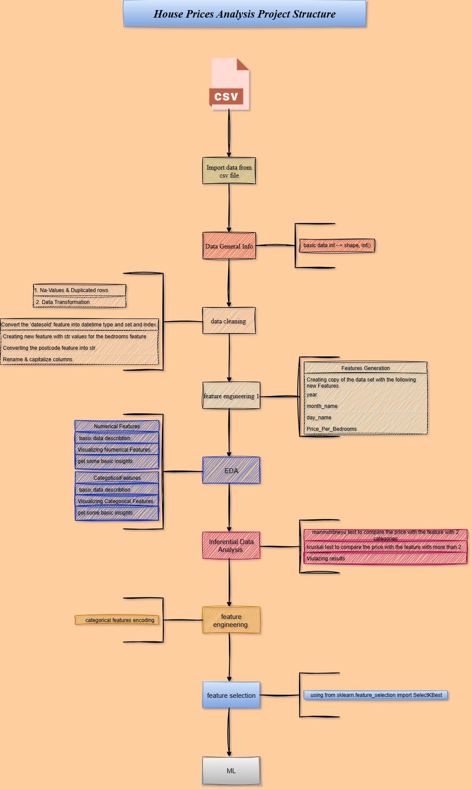

# Home_Prices_analysis


## How to run ?

*Clone the repository:*

```bash
https://github.com/omars1234/Home_Prices_analysis.git
```

```bash
conda create --name EnvHomePrices python=3.8.2 -y
```

```bash
conda activate EnvHomePrices
```

```bash
pip install -r requirements.txt
```

## *Project Structure :*


